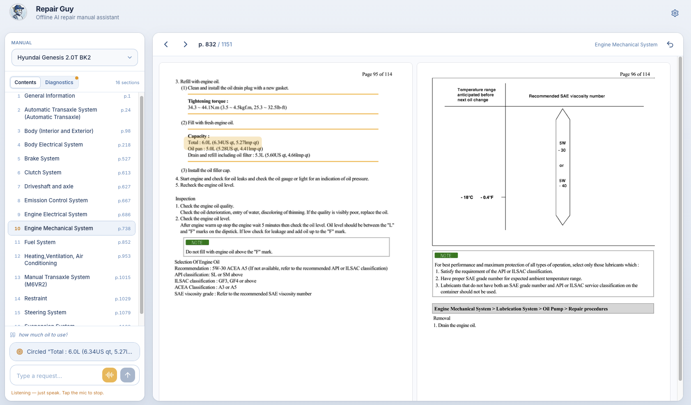
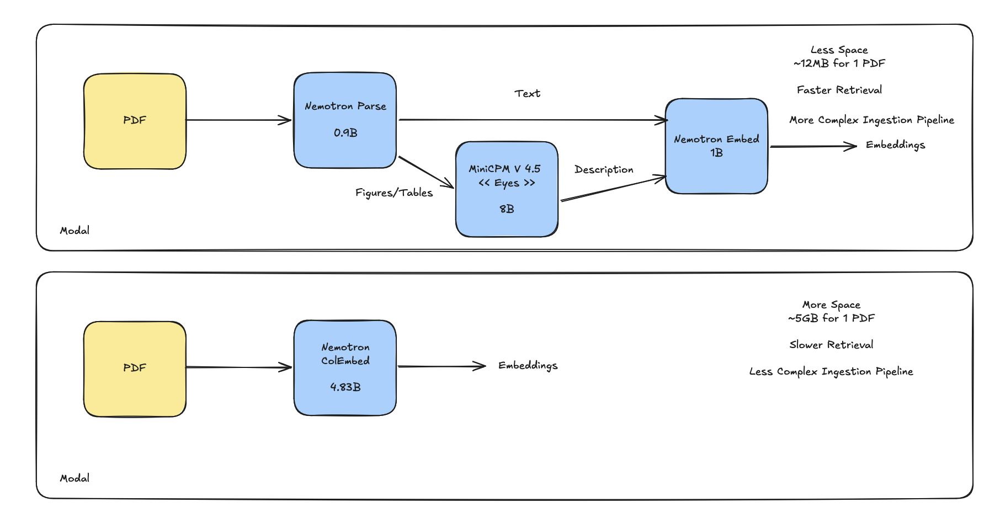
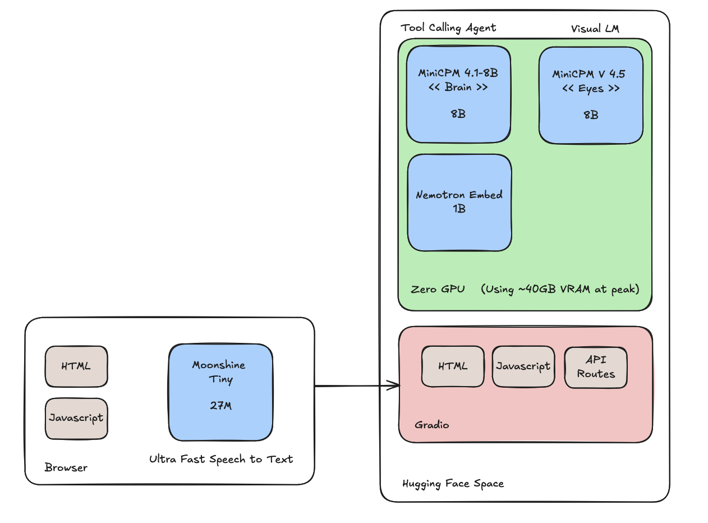

## Motivation
I am a strong believer that small models are the next frontier and almost vital for businesses to invest in. Models hosted on the cloud can change at any time and you are at the mercy of their deprecation windows (I've experienced this first hand, luckily evals are a huge help here).

The [build small hackathon by gradio and hugging face](https://huggingface.co/build-small-hackathon) was a great opportunity for me to try and build something with these models since I've been spoiled by the raw intelligence of cloud models for a while now.

Some of my days are spent reading through my car manual and usually my hands are dirty or I have gloves and it's tough scrolling through your phone or tablet and if you're lucky to have your physical repair manual, it gets all greasy and the wind moves the pages around.

Maybe I'm the only guy with this problem but, thought it would be fun to try and make an AI tool that would eventually run offline and on device that can navigate the repair manuals for me.

## The App

### Document Ingestion

I knew that I had to find a way to store the PDF pages in a way that I can search through them. Repair manuals have a lot of images and tables.

[Nemotron Parse v1.2](https://huggingface.co/nvidia/NVIDIA-Nemotron-Parse-v1.2) was a great model for this since it takes a PDF and outputs bounding boxes for the images it finds. I used this to my advantage to take the descriptions and pass that to a VLM [MiniCPM V4.5](https://huggingface.co/openbmb/MiniCPM-V-4_5).

Finally, I used [Nemotron Embed](https://huggingface.co/nvidia/llama-nemotron-embed-vl-1b-v2) to create the embeddings from the text chunks and figure/table descriptions.

This index was very small ~12MB and retrieval was super fast few ms. Then, I read about [Nemotron ColEmbed](https://huggingface.co/nvidia/nemotron-colembed-vl-4b-v2) and decided to try it out since I've never used a late interaction embedding model. 

I decided to create an index using this model so I could compare the two since it was really easy, I just had to pass the PDF and the model created multiple embeddings (no description pass or anything). The takeaway was that while colembed got me to the right page more often than the more complex nemotron pipeline, the storage requirements were HUGE!

It was about ~5GB to store the embeddings compared to 12MB and the retrieval latency was about 5-6 seconds compared to about 20ms for the other approach. Hit@3 was also only about 7-8% difference for my use case. So given that this model was too large to store in VRAM and the storage requirements were too large, it wouldn't be possible to get this working on edge devices so I stayed with the first pipeline.

### The Brain

The tools I ended up shipping were:
- search(query) -> k pages (k is configurable): this is a pure vector similarity search on the configured index
- go_to_page(page_number): goes to specified page number
- circle(query, page_number) -> bounding box: a request to the vlm to circle something on the page

There was a side quest to use OpenBMB models for most of the app so I tried out [MiniCPM 5 1B](https://huggingface.co/openbmb/MiniCPM5-1B) and I spent way too much time trying to get this to work reliably for tool calling. It would fascinate me sometimes and then sometimes really frustrate me. I tried a few different ensemble approaches like:
- (making the problem simpler) first call to classify tool call then second to generate tool args
- (removing conversation history) first one to rewrite conversation history and second to perform tool call
- several different prompting approaches
- removing tools

The issues I struggled with were:
- tool args that made no sense
- parroting
- stayed on same page when i asked for something completely different

I ended up deciding that I will need to try and sit down and find different ways to prompt this model or finetune this model for this task to see how far it would go just to experiment and see where the capabilities are. So I started tracing everything on Langfuse so I could use that data for training later on when I had more time.

Then I went with [MiniCPM 4.1 8B](https://huggingface.co/openbmb/MiniCPM4.1-8B) and it performed way better on my limited evals (it was about a 20% difference in both tool calling decisions and tool arg selection).

### Overall Impression
It performed really well when I switched over to the 8B model. Mistakes were more rare and when they did happen they were easy to recover from. The app is reasonably fast (~4-6 seconds per message) but I feel to really be useful, it needs to be a bit faster. I did add phrases that got executed with code like next page, previous page and go to page so it would feel almost instant for the user. 
Think it will be fun to keep experimenting and see where I can take this. I have learned a lot so far.

## Final Words
All the code (with evals, scripts, etc) are hosted on [my github here](https://github.com/ai-rayven/repair-guy)